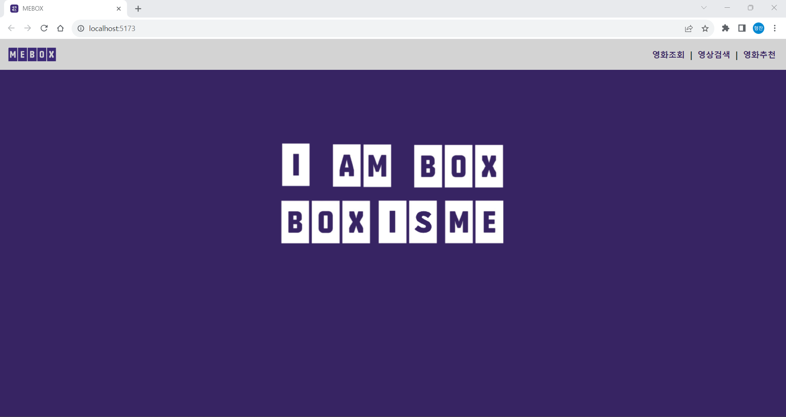
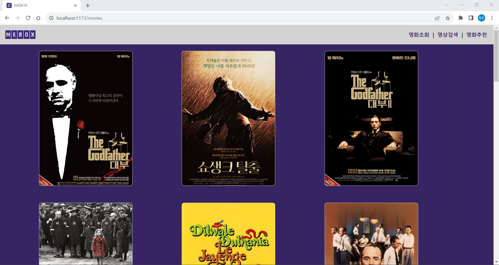
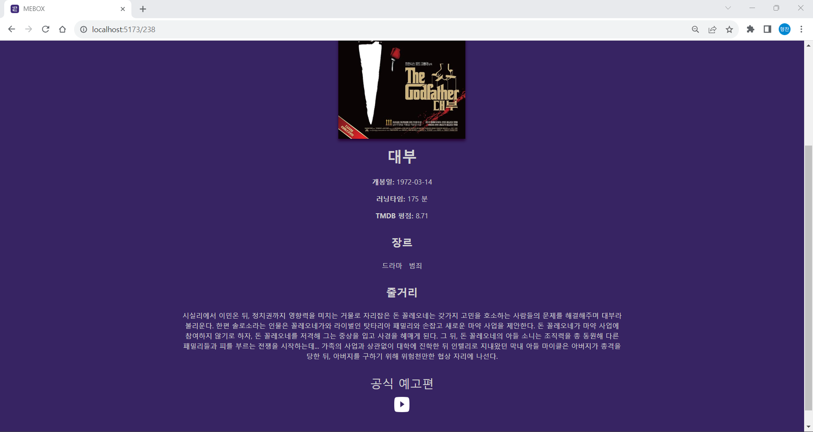
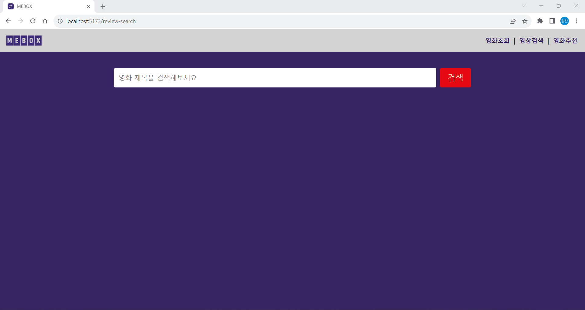

# PJT09 - Vue를 활용한 SPA 구성

## 목표
```
● AJAX 통신과 JSON 구조에 대한 이해
● 영화 정보를 제공하는 SPA 제작
● 유튜브 API 활용하여 영화 정보 제공
```
## 개발도구
```
● Vite, Vue Router
```
## 어려웠던 부분
```
● 영화 api와 유튜브 api를 적용시키는 과정
● 생각보다 쉽지 않고 오래걸리는 css
```
## 내용
```
● 영화들을 평점 순으로 나열
● 영화 포스터를 클릭하면 영화 정보와 예고편 시청 가능
● 유튜브 검색으로 영화 관련 영상 검색 후 시청 가능
```
## 느낀점
```
● 점점 완성 되어가는 느낌이 듬.
● 로고나 디자인 부분을 수행하는 과정이 재밌었음.
● 하지만 예상보다 css부분이 오래걸리고 복잡함.
```
## 기타
```
● 조금의 오타나 실수로 인해 오랜시간을 낭비해 버렸음.
● 부족한 점을 페어인 김현지에게 많이 도움을 받고 있음.
● 백엔드보다는 프론트엔드가 더욱 적성에 맞는다는 생각이 듬. 
```
메인 화면


영화 조회 화면


영화 정보 화면


검색 화면


```유튜브 API 할달량 다 사용해서 캡처 하지 못했음.```